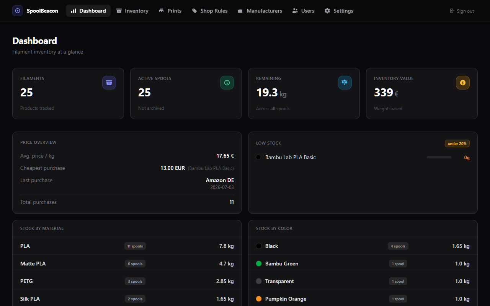
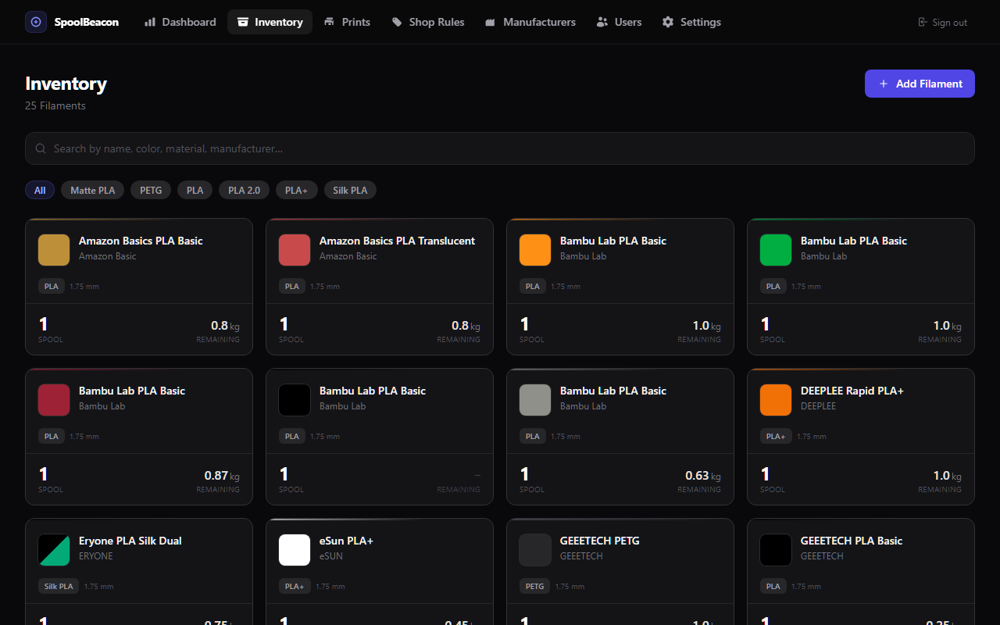
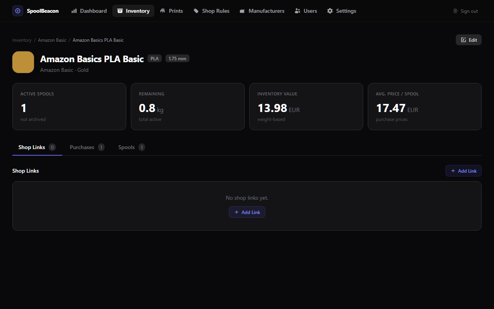
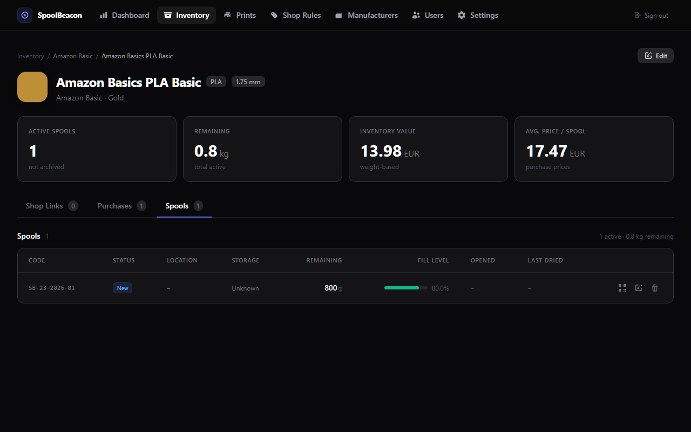
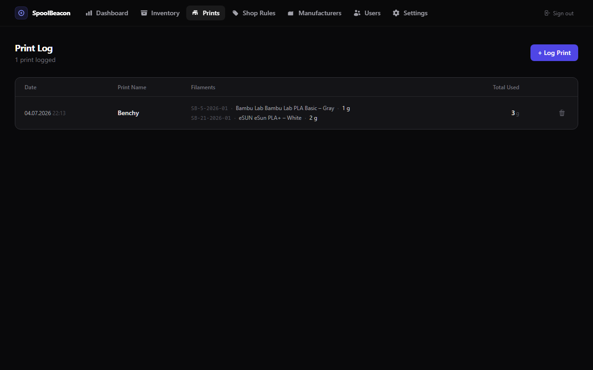
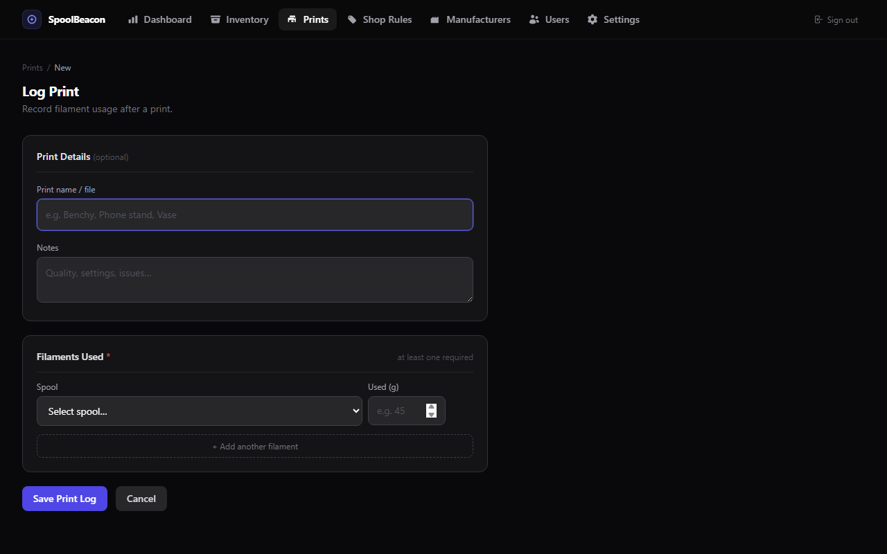
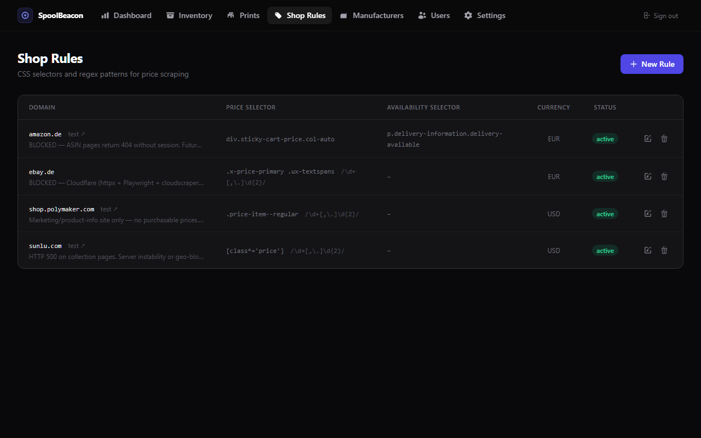
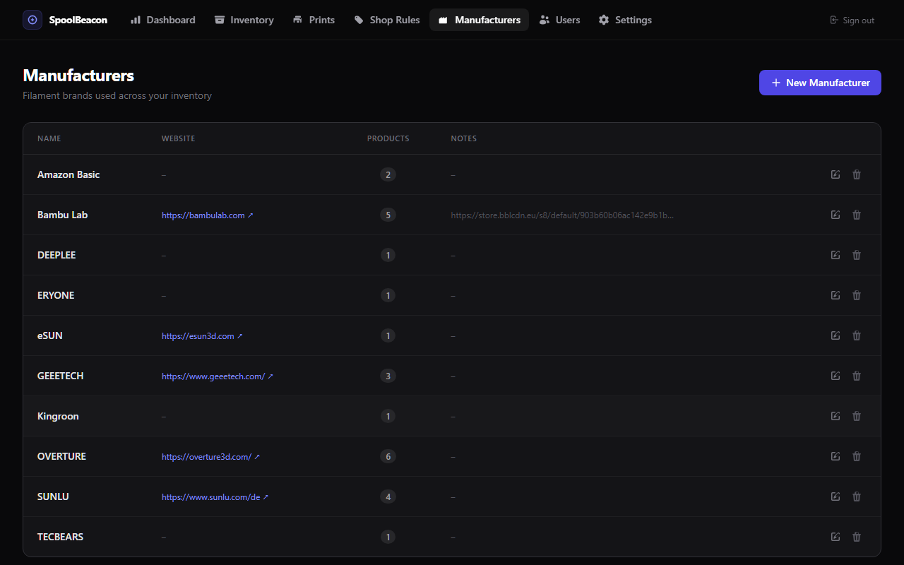
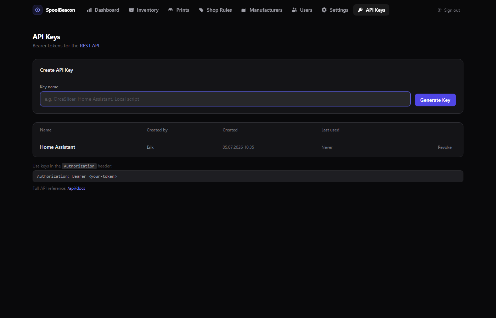

<div align="center">

# SpoolBeacon

**Self-hosted filament inventory for 3D printing.**
Track spools, purchases and shop prices — get notified when a filament hits your target price.

[](LICENSE)
[](https://github.com/Erik05Master/SpoolBeacon/actions/workflows/docker-publish.yml)
[](https://hub.docker.com/r/sytxlabs/spoolbeacon)
[](https://www.python.org/)

[Quick Start](#quick-start-docker) · [Features](#features) · [Configuration](#configuration) · [Price Monitoring](#price-monitoring) · [Troubleshooting](#troubleshooting)

</div>

---

## Screenshots

| Dashboard | Inventory |
|---|---|
|  |  |

| Filament Detail | Spools |
|---|---|
|  |  |

| Print Log | Log Print Form |
|---|---|
|  |  |

| Shop Rules | Manufacturers |
|---|---|
|  |  |

| API Keys |
|---|
|  |

---

## 📦 Features

|                      |                                                                                                                                                                               |
|----------------------|-------------------------------------------------------------------------------------------------------------------------------------------------------------------------------|
| **Inventory**        | Filaments by manufacturer, material, color and diameter — including dual-color/co-extruded filaments. Spools track remaining weight, fill %, storage location and status.     |
| **Print Log**        | Log every print job with name, notes and one or more filament lines. Each line deducts used grams from the spool and auto-updates its status (opened → almost empty → empty). |
| **Manufacturers**    | Dedicated manufacturer pages listing every product from that brand.                                                                                                           |
| **Purchase history** | Price per spool, lot number, currency — spools are auto-created on purchase.                                                                                                  |
| **Price monitoring** | Shop links with manual prices and automated scraping via ShopRules or built-in adapters.                                                                                      |
| **Price alerts**     | Alert when price ≤ target (absolute or per kg) — Discord and SMTP notifications.                                                                                              |
| **Spool labels**     | Printable QR-code labels per spool for physical tagging.                                                                                                                      |
| **Backup & restore** | Full JSON export/import — additive, safe to re-run.                                                                                                                           |
| **Dashboard**        | Overview, low-stock list, material/color breakdown, active alerts, scheduler status.                                                                                          |
| **User management**  | Admin / Member / Viewer roles — Viewer is fully read-only.                                                                                                                    |
| **REST API**         | Full JSON API with bearer-token auth — read/write inventory, spools and print jobs. Interactive docs at `/api/docs` (Swagger UI).                                             |

---

## 🔧 Requirements

- Docker + Docker Compose

For local development: Python 3.12+

---

## 🚀 Quick Start

### Option A — Docker Hub (recommended, no clone needed)

Create a `compose.yaml`:

```yaml
services:
  web:
    image: sytxlabs/spoolbeacon:latest
    ports:
      - "${APP_PORT:-8080}:${APP_PORT:-8080}"
    env_file: .env
    restart: unless-stopped
    depends_on:
      db:
        condition: service_healthy

  db:
    image: mariadb:11
    restart: unless-stopped
    environment:
      MARIADB_ROOT_PASSWORD: ${DB_PASSWORD}
      MARIADB_DATABASE: ${DB_NAME}
      MARIADB_USER: ${DB_USER}
      MARIADB_PASSWORD: ${DB_PASSWORD}
    volumes:
      - db_data:/var/lib/mysql
    healthcheck:
      test: ["CMD", "healthcheck.sh", "--connect", "--innodb_initialized"]
      interval: 10s
      timeout: 5s
      retries: 5

volumes:
  db_data:
```

Create a `.env` next to it:

```env
SECRET_KEY=       # generate: python -c "import secrets; print(secrets.token_hex(32))"
APP_PORT=8080
DB_HOST=db
DB_PORT=3306
DB_USER=spoolbeacon
DB_PASSWORD=changeme
DB_NAME=spoolbeacon
QUART_AUTH_COOKIE_SECURE=true
```

Pull and start:

```bash
docker compose up -d
```

### Option B — From source (GitHub)

```bash
git clone https://github.com/Sytxlabs/SpoolBeacon.git
cd SpoolBeacon
cp .env.example .env   # edit SECRET_KEY and DB_PASSWORD
docker compose up --build -d
```

---

MariaDB starts automatically, migrations run on container start. The app is exposed on `APP_PORT` (default `8080`) — only that port is mapped to the host, MariaDB stays internal to the compose network.

### First admin account

Open `http://your-host:8080/setup` — only available when no users exist yet.

---

## ⬆️ Updating

**Docker Hub install:**

```bash
docker compose pull
docker compose up -d
```

**From source:**

```bash
git pull
docker compose up --build -d
```

Migrations run automatically on restart.

---

## 🛠️ Local Development

```bash
python -m venv .venv
source .venv/bin/activate
pip install -r requirements.txt
playwright install --with-deps chromium
cp .env.example .env   # fill in DB credentials
python migration.py upgrade head
python main.py         # runs on http://localhost:8080
```

Seed sample data:

```bash
python seed.py           # manufacturers, products, purchases, links, rules (idempotent)
python seed.py --reset   # wipe all tables (except users/settings) and re-seed
python seed_shops.py     # ShopRules only, no inventory data
```

---

## ⚙️ Configuration

All runtime settings are managed on the Settings page (`/settings`, admin only) — not via `.env`.

| Section | What you can configure |
|---|---|
| Scheduler | Enable automatic price checks, set interval in minutes |
| Fetch engine | `playwright` (default, JS-capable) or `httpx` (faster, no JS) |
| Discord | Webhook URL, enable/disable, test message |
| Email (SMTP) | Host, port, credentials, TLS, from/to address, test email |
| Spool code template | Pattern for auto-generated spool codes |
| Backup & Restore | Export full inventory as JSON, import additively (admin only) |

---

## 📈 Price Monitoring

### Built-in Adapters

These shops work out of the box without any manual configuration:

| Shop | Method |
|---|---|
| `3djake.de` | CSS selector |
| `prusa3d.com` | JSON-LD |
| `anycubic.com` | Shopify JSON-LD |
| `eu.store.bambulab.com` | JSON-LD (cloudscraper) |
| `esun3dstore.com` | Shopify JSON-LD (cloudscraper) |
| `esun3dstoreeu.com` | Shopify JSON-LD (cloudscraper) |
| `elegoo.com` | Shopify og:price:amount |

To add a new adapter: subclass `BaseAdapter` in `app/shop_adapters/`, implement `extract(html, url) -> AdapterResult`, register in `registry.py` via `_reg(YourAdapter())`.

### ShopRules (generic)

For any other shop: create a rule at `/shop-rules` with domain, CSS price selector, and optional regex — or use the visual point-and-click picker to build one without touching CSS. German (`1.299,00 €`) and English (`1,299.00`) price formats are detected automatically.

---

## 🖨️ Print Log

Navigate to **Prints** in the nav bar (or `/prints/`) to see all logged print jobs.

Hit **+ Log Print** to record a new job:

1. Enter an optional print name and notes.
2. Add one or more filament lines — select a spool from the grouped dropdown, enter grams used. The live preview shows how much is left on that spool.
3. Hit **Save Print Log** — remaining weight is deducted from each spool immediately and spool status updates automatically (new → opened → almost empty → empty).

Supports multi-filament prints (e.g. dual-extrusion or colour changes mid-print) by adding multiple lines.

---

## 🔌 REST API

SpoolBeacon exposes a versioned JSON API at `/api/v1/`. Interactive documentation (Swagger UI) is available at
`/api/docs` — no login required, just a bearer token.

### Authentication

API keys are managed at `/api-keys` (admin only). Each key is shown **once** at creation time and stored as a SHA-256
hash.

```http
Authorization: Bearer <your-token>
```

### Endpoints

| Method | Path                    | Description                                                                    |
|--------|-------------------------|--------------------------------------------------------------------------------|
| GET    | `/api/v1/health`        | Health check (no auth required)                                                |
| GET    | `/api/v1/manufacturers` | List all manufacturers                                                         |
| GET    | `/api/v1/products`      | List all filament products                                                     |
| GET    | `/api/v1/products/{id}` | Product detail including all spools                                            |
| GET    | `/api/v1/spools`        | List spools — filter with `?status=new\|opened\|almost_empty\|empty\|archived` |
| GET    | `/api/v1/spools/{id}`   | Single spool                                                                   |
| PATCH  | `/api/v1/spools/{id}`   | Update remaining weight `{"remaining_g": 450}` — status auto-updates           |
| GET    | `/api/v1/prints`        | Paginated print jobs (`?page=`, `?per_page=` max 100)                          |
| POST   | `/api/v1/prints`        | Log a print job (deducts weight from spools)                                   |

### POST /api/v1/prints body

```json
{
  "print_name": "Benchy",
  "notes": "Optional",
  "lines": [
    {
      "spool_id": 3,
      "used_g": 12.5
    },
    {
      "spool_id": 7,
      "used_g": 4.0
    }
  ]
}
```

Spool weight is deducted immediately and spool status auto-updates (new → opened → almost empty → empty).

### Quick example

```bash
TOKEN=your-token-here

# List active spools
curl -H "Authorization: Bearer $TOKEN" http://your-host:8080/api/v1/spools?status=opened

# Log a print job
curl -X POST \
  -H "Authorization: Bearer $TOKEN" \
  -H "Content-Type: application/json" \
  -d '{"print_name":"Benchy","lines":[{"spool_id":1,"used_g":6.2}]}' \
  http://your-host:8080/api/v1/prints
```

Full schema and "Try it out" in Swagger UI: `http://your-host:8080/api/docs`

---

## ⚠️ Known Limitations

- **Amazon / eBay** not supported — Amazon requires an authenticated session or the Product Advertising API; eBay blocks scraping via Cloudflare
- **Heavy WAFs** (Cloudflare Enterprise) block even cloudscraper — a proxy or official API is needed
- **No printer / slicer integration** — no Klipper, OrcaSlicer or automatic print job import; print jobs can be
  submitted via the REST API
- **No mobile app** — web only, mobile-optimised responsive layout

---

## 🩺 Troubleshooting

<details>
<summary><strong>App won't start — <code>Database not initialized</code></strong></summary>

Check DB credentials in `.env`. MariaDB must be reachable and the database must exist.
</details>

<details>
<summary><strong>Migrations fail — <code>Table already exists</code></strong></summary>

Run `python migration.py stamp head` to mark the current state, then migrate.
</details>

<details>
<summary><strong>Playwright checks time out</strong></summary>

Increase `playwright.timeout_ms` in Settings (default: 30 000 ms).
</details>

<details>
<summary><strong>Price not found</strong></summary>

The shop's HTML structure changed. Use the Test button on `/shop-rules` and update the selector/regex.
</details>

<details>
<summary><strong>Setup page unavailable</strong></summary>

`/setup` is locked once a user exists. Add users via `/users` (admin only).
</details>

---

## 🐳 Docker Image

Pre-built images are published to [Docker Hub](https://hub.docker.com/r/sytxlabs/spoolbeacon) on every push to `master` and on version tags:

| Tag | Description                       |
|---|-----------------------------------|
| `sytxlabs/spoolbeacon:latest` | Latest stable build from `master` |
| `sytxlabs/spoolbeacon:<version>` | Pinned release (e.g. `1.0.0`)     |

```bash
docker pull sytxlabs/spoolbeacon:latest
```

---

## 📄 License

[MIT](LICENSE) — see the LICENSE file for details.
